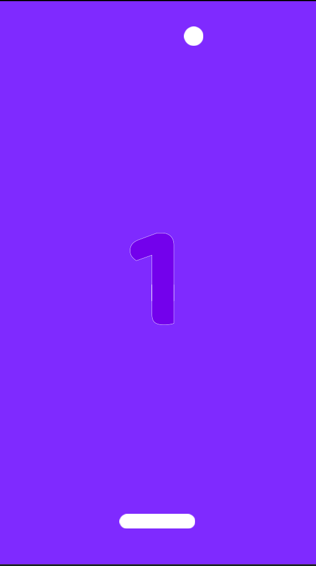

# Projeto feito com Godot Engine

### Objetivo:
#### Se trata de um projeto de um jogo de pong, no qual o objetivo é alcançar o maior numero de pontos, explodindo asteroides e atigindo o topo da tela.
### Como Jogar:
#### Rode o projeto atraves da engine da Godot e pressione a tecla SPACE para inicar. Quanto maior o numero de pontos, mais rapido a bola fica. Voce perde o jogo se nao conseguir colidir com a bola.

## Pong Game
